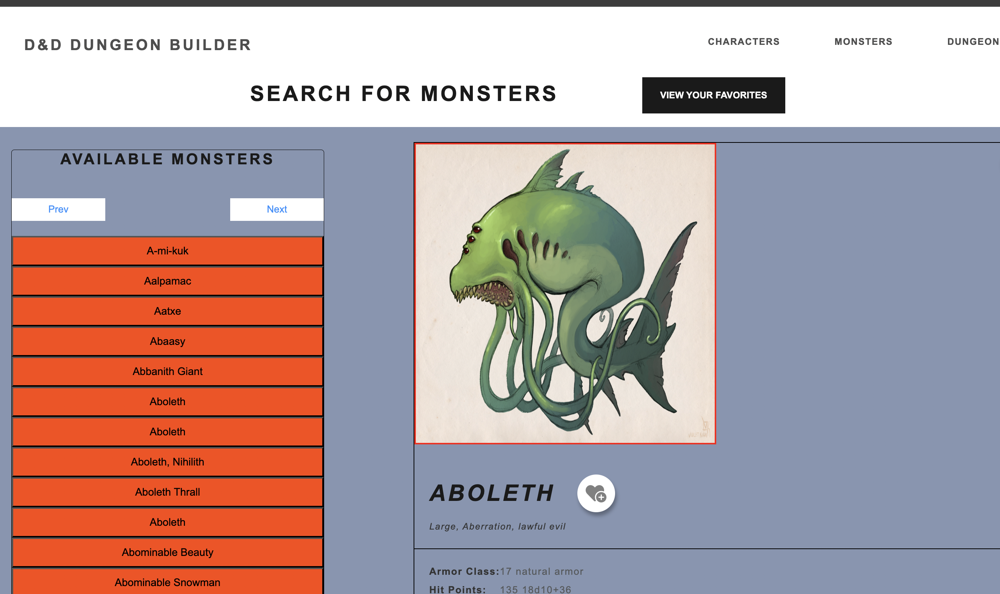

# D&D Builder App: Frontend React App

run `npm install` in the client directory
run `npm run dev`

I built this frontend utilizing this D&D api, `https://api.open5e.com`, which provided its challenges because the data stored for the monsters is not exactly uniform, some monsters get an img_main property with null, some return an img_main property that is part of url that goes nowhere, doesn't provide the image resource and some do, there were a lot of inconsistencies. I could have done a lot better and ran short of time to fix a lot of things, especially styling.
